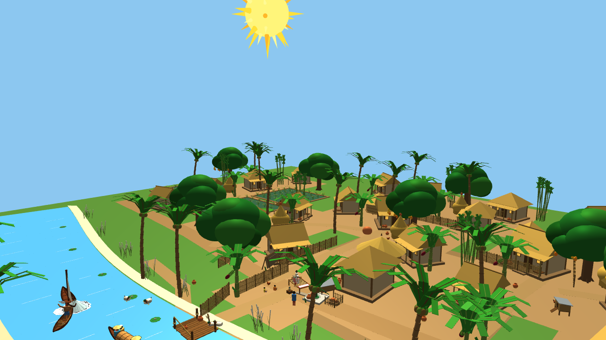

# 🌾 Village Gathering by the River (নদীর তীরে গ্রামীণ সন্ধ্যা)
### *A Bangladeshi Rural Night Scene in 3D — Procedural OpenGL 3.3 Core Profile*

[](https://isocpp.org/)
[](https://www.khronos.org/opengl/)
[](https://www.khronos.org/opengl/)
[](https://www.microsoft.com/)
[](https://www.kuet.ac.bd/)
[](LICENSE)

An authentic, fully procedural real-time 3D simulation of a traditional Bangladeshi riverine village (*Gramin Shondha*). Developed as the capstone laboratory project for **CSE 4100: Computer Graphics and Image Processing Laboratory** at **Khulna University of Engineering & Technology (KUET)**.

> **Zero External 3D Models Imported:** In strict adherence to graphics curriculum requirements, **100% of all geometry** is synthesized algorithmically on the GPU from elementary mathematical primitives (Unit Cube, Unit Triangle, Unit Sphere) and affine transformation pipelines.

---

## 📸 Visual Showcase

| Grand Village Panorama (Key `8` / Startup) | Meandering River & Country Boats (Key `2`) |
|:---:|:---:|
|  |  |

| Historic Terracotta Village Mosque (Key `3`) | Homestead, Cow Shed & Farmyard (Key `4`) |
|:---:|:---:|
|  |  |

| Daytime Radiant Sunlight Mode (Key `L`) | Shaded Village Road & Banyan Tree (Key `6`) |
|:---:|:---:|
|  |  |

---

## 🌟 Key Technical Highlights & Curriculum Mapping

### 1. 📐 Mathematical Transformation Pipeline
* **Coordinate Transformations:** Full transition pipeline from **Object Space $\rightarrow$ World Space $\rightarrow$ View Space (Eye) $\rightarrow$ Clip Space $\rightarrow$ NDC $\rightarrow$ Viewport Screen Space**.
* **Model Matrix Derivation:** Composite transformation matrices computed per object:
  $$\mathbf{M} = \mathbf{T}(t_x, t_y, t_z) \cdot \mathbf{R}_y(\theta_y) \cdot \mathbf{R}_x(\theta_x) \cdot \mathbf{R}_z(\theta_z) \cdot \mathbf{S}(s_x, s_y, s_z)$$
* **Hierarchical Articulated Rigging:** Forward kinematics kinematic chains for articulated villagers, rowing boatmen, and moving machinery:
  $$\mathbf{M}_{\text{child}} = \mathbf{M}_{\text{parent}} \cdot \mathbf{T}_{\text{joint}} \cdot \mathbf{R}_{\text{joint}} \cdot \mathbf{T}_{\text{offset}} \cdot \mathbf{S}_{\text{limb}}$$
  *(e.g., Torso $\rightarrow$ Shoulder $\rightarrow$ Elbow $\rightarrow$ Hand $\rightarrow$ Palm Fan / Oar)*

### 2. 💡 Illumination Models & Dual Shading Architecture
* **Blinn-Phong Illumination Equation:** Evaluated per fragment or per vertex:
  $$I = I_{\text{ambient}} + I_{\text{diffuse}} + I_{\text{specular}} + I_{\text{emissive}}$$
  * **Ambient:** $k_a \cdot I_a$
  * **Diffuse (Lambertian):** $k_d \cdot I_d \cdot \max(\vec{N} \cdot \vec{L}, 0)$
  * **Specular (Blinn-Phong):** $k_s \cdot I_s \cdot \max(\vec{N} \cdot \vec{H}, 0)^\alpha$ where $\vec{H} = \frac{\vec{L} + \vec{V}}{\|\vec{L} + \vec{V}\|}$
* **Point Light Inverse-Square Physical Attenuation:** 6 localized light sources (Courtyard Hariken, Moored Boat Lantern, Mosque Portal, Clay Cooking Stove, Ghat, Cruising Boat) incorporating distance falloff:
  $$\text{Attenuation} = \frac{1}{K_c + K_l \cdot d + K_q \cdot d^2}$$
* **Dual Shading Toggle (Key `M`):**
  * **Phong Shading (Per-Fragment):** Normals interpolated across polygons and normalized per fragment; yields pinpoint specular highlights and curved silhouettes.
  * **Gouraud Shading (Per-Vertex):** Lighting evaluated at triangle vertices and linearly interpolated across fragments via hardware rasterizer; ultra-fast rendering.
* **Light Inside vs. Object Inside Light:** Emissive radiosity for lanterns, the Full Moon, fireflies, and stove embers ($E > 0.5$).
* **Hard Light vs. Soft Light (Key `U`):** Sharp cutoff terminator vs. smooth wrap-around diffuse.

### 3. ⚡ Real-Time Whitted-Style Ray Tracing Engine (Bonus Feature - Key `Y`)
* Dedicated GLSL 330 Core recursive ray tracer running concurrently on a full-screen quad:
  * **Primary Camera Rays:** Cast through perspective projection screen coordinates.
  * **Analytic Intersections:** Ray-Sphere ($\|\vec{P} - \vec{C}\|^2 = R^2$), Ray-Box (slab method), and Ray-Plane equations.
  * **Shadow Rays:** Geometric line-of-sight occlusion testing for razor-sharp ray-traced shadows.
  * **Specular Mirror Reflections:** Multi-bounce recursive reflections ($\vec{R} = \vec{D} - 2(\vec{D} \cdot \vec{N})\vec{N}$) on water and polished brass.

### 4. 🌊 Kinematics & Dynamic Water Simulation
* **Meandering River Channel:** Non-linear parametric centerline:
  $$X_{\text{center}}(z) = 1.8 \sin(0.08z + 0.4) + 0.6 \cos(0.04z)$$
* **Time-Varying Wave Ripples:** Horizontal surface ripples displaced dynamically along river flow:
  $$\Delta X(z, t) = \sin(3.1r + t \cdot 0.4) \cdot 2.6, \quad \text{FlowOffset} = (t \cdot 0.35 + 0.6r) \pmod{1.0} \cdot 0.3$$

### 5. 🏺 Parametric Cubic Bézier Surface of Revolution (Key `V`)
* Smooth traditional terracotta pitcher (*Matir Surahi*) sculpted by revolving a 4-control-point cubic Bézier profile curve:
  $$\mathbf{B}(u) = (1-u)^3 P_0 + 3(1-u)^2 u P_1 + 3(1-u) u^2 P_2 + u^3 P_3, \quad u \in [0, 1]$$
* Full analytic surface normal derivation:
  $$\mathbf{N}(u, \theta) = \frac{\partial \mathbf{S}}{\partial \theta} \times \frac{\partial \mathbf{S}}{\partial u} = \text{normalize}\left(\frac{dy}{du}\cos\theta, -\frac{dr}{du}, \frac{dy}{du}\sin\theta\right)$$

---

## 🎮 Interactive Controls & Vehicle Dynamics

The simulation features complete real-time interactivity, vehicle physics, step advancements, and camera navigation:

| Key / Control | Functionality & Interaction Logic | Technical Parameters |
|:---:|:---|:---|
| **`M`** | **Toggle Shading Model** | Switches live between **Phong (Per-Fragment)** and **Gouraud (Per-Vertex)** |
| **`Y`** | **Toggle Ray Tracing Engine** | Activates Real-Time Whitted Recursive Ray Tracing mode (GLSL 330) |
| **`L`** | **Cycle Lighting Modes** | 0: Moonlit Night $\rightarrow$ 1: Radiant Day $\rightarrow$ 2: Unlit 3D Facets $\rightarrow$ 3: Flat Color |
| **`G`** | **Bullock Cart Step Advance** | Rolls wheels dynamically and advances cart forward along road by **3.80 m** |
| **`N`** | **Country Boat Step Advance** | Animates full $360^\circ$ rowing stroke and glides Dingi Nouka forward by **4.00 m** |
| **`H`** | **Agricultural Plowing Advance** | Advances draft oxen team and farmer forward through soil by **2.80 m** |
| **`P`** | **Tubewell Water Pump Action** | Points camera at tubewell; animates handle and pours crystal water stream into Kolshi for **4.5s** |
| **`W / S`** | **Vehicle Throttle / Reverse** | Accelerates cart, boat, or oxen forward/backward (Cart: $18\text{ m/s}$, Boat: $20\text{ m/s}$) |
| **`A / D`** | **Steer Left / Right** | Controls wheel heading, boat rudder, or oxen steering with natural turning physics |
| **`SPACE`** | **Cinematic Drone Tour** | Starts automated **26-second** multi-waypoint aerial fly-through tour across all 8 landmarks |
| **`J`** | **Directional Light Toggle** | Toggles Moonlight / Sunlight ON or OFF to inspect pure point light attenuation |
| **`O`** | **Cycle 6 Point Lights** | 1.0x Normal $\rightarrow$ 1.85x Blazing $\rightarrow$ 0.45x Soft Amber $\rightarrow$ Extinguished (OFF) |
| **`U`** | **Hard Light vs. Soft Light** | Toggles sharp contrast terminator vs. gentle wrap-around diffuse |
| **`Z`** | **Wireframe Mode** | Toggles `glPolygonMode` between `GL_LINE` and `GL_FILL` for geometric inspection |
| **`X`** | **Texture Mapping Mode** | Cycles: 0: Solid Geometry $\rightarrow$ 1: Procedural GLSL Textures $\rightarrow$ 2: GPU Texture Maps |
| **`T`** | **Terrain Visibility** | Toggles ground & river rendering to view freestanding procedural models |
| **`B`** | **Summer Breeze Wind Sway** | Toggles tree foliage, frond sway, and boat mast flutter |
| **`[` / `]`** | **Animation Speed** | Decreases (-0.25x) or Increases (+0.25x) dynamic simulation playback rate |
| **`K`** | **Pause / Resume** | Freezes/resumes continuous physics and animal motion |
| **`1` – `9`, `0`** | **Camera Inspection Views** | `1`: Courtyard, `2`: River/Boats, `3`: Mosque, `4`: Farmstead, `9`: Halchas, `0`: Cow Shed |
| **`V` / `F`** | **Object Close-Up Views** | `V`: Parametric Bézier Vase, `F`: River Fisherman hunting leaping silver fish |
| **`Mouse Drag`** | **Orbit Camera** | Left-click drag adjusts camera azimuth ($yaw$) and elevation ($pitch$) |
| **`Scroll`** | **Camera Dolly Zoom** | Smooth physical camera distance adjustment ($1.5\text{m} - 70\text{m}$) preserving perspective |

---

## 🏗️ Project Architecture & File Structure

```
Hitlar/
├── include/                     # C++ Header files
│   ├── Camera.h                 # Spherical orbit and free-flight 6DOF camera
│   ├── mathutil.h               # Vector/matrix math (vec2, vec3, vec4, mat4, transform routines)
│   ├── Primitives.h             # Canonical unit geometry generators (Cube, Sphere, Triangle)
│   ├── Shader.h                 # GLSL shader compiler, program linker & uniform binders
│   ├── Texture.h                # Procedural & GPU texture sampler management
│   └── objects/                 # Object modeling domain headers
│       ├── Boat.h, Boatman.h    # Traditional country boats & animated rowing majhi
│       ├── Charpai.h            # Woven jute cot, stool & Dietz hurricane lantern
│       ├── CurvedObject.h       # Cubic Bézier vase & arched parabolic bamboo bridge
│       ├── Duck.h, Hen.h        # Diurnal animal rigs, swimming & peck gaits
│       ├── Fireflies.h          # Emissive pulsing nocturnal insects
│       ├── Fisherman.h          # River fisherman, cast net & jumping silver fish
│       ├── House.h              # Dochala, Chouchala, cow shed, tubewell & clay stove
│       ├── Moon.h, Sun.h, Stars.h # Celestial bodies & starry night sky dome
│       ├── Mosque.h             # Ancient Sultanate terracotta brick mosque & minaret
│       ├── Person.h             # Procedural humanoid rig, attire & hand fan hierarchy
│       ├── RayTracer.h          # Real-time Whitted ray tracing engine
│       ├── River.h              # Meandering river kinematics, sandy chars & reeds
│       └── Terrain.h, Tree.h    # Grameen ground, paddy plots & native flora
├── src/                         # Implementation source files
│   ├── Camera.cpp               # Camera coordinate math & dolly zoom implementation
│   ├── Primitives.cpp           # GPU VAO/VBO allocations for unit primitives
│   ├── Shader.cpp               # Built-in Blinn-Phong & Gouraud vertex/fragment GLSL shaders
│   ├── Texture.cpp              # Texture mapping pipeline
│   └── objects/                 # 18 Modular procedural 3D object implementations
│       └── (Boat, House, Person, River, Tree, RayTracer, Mosque, etc.)
├── object_images/               # High-resolution benchmark screenshots of all 34 procedural models
├── glad.c                       # GLAD Multi-Language GL Loader (OpenGL 3.3 Core)
├── main.cpp                     # Scene compositor, key callbacks, driving physics & render loop
├── Hitlar.vcxproj               # Visual Studio C++ project configuration
├── run.bat                      # Instant compile, sign & execution launcher script
└── README.md                    # Project documentation
```

---

## 🛠️ Build & Execution Instructions

### Prerequisites
* **Operating System:** Windows 10 / 11 (64-bit)
* **IDE / Toolchain:** Microsoft Visual Studio 2022 (v143 toolset) with C++ Desktop Development
* **Graphics Hardware:** GPU with OpenGL 3.3 Core Profile support

### Quick Run (One-Click)
Double-click `run.bat` or execute in PowerShell:
```powershell
.\run.bat
```
The script will locate your installed `MSBuild.exe`, build the solution in `x64\Debug`, and launch `Hitlar.exe`.

### Manual Build via Developer PowerShell
```powershell
& "C:\Program Files\Microsoft Visual Studio\18\Community\MSBuild\Current\Bin\MSBuild.exe" Hitlar.vcxproj /p:Configuration=Debug /p:Platform=x64
.\x64\Debug\Hitlar.exe
```

---

## 📜 Academic Attribution & Honor Code

* **Institution:** Khulna University of Engineering & Technology (KUET)
* **Department:** Department of Computer Science and Engineering (CSE)
* **Course:** CSE 4100 — Computer Graphics and Image Processing Laboratory
* **Student Roll:** 2107064
* **Academic Term:** 4th Year, 1st Term (4-1)

---

## 📄 License
This project is open-source under the [MIT License](LICENSE). Educational demonstration code created for academic laboratory milestone evaluation.
