# Procedural 3D Object Catalog & Geometric Construction Guide
**Course:** Computer Graphics & Image Processing Laboratory (CSE 4100 / KUET)  
**Project Title:** Village Gathering by the River – A Bangladeshi Rural Night Scene in 3D  
**Rendering Engine:** OpenGL 3.3 Core Profile (GLSL 330 core, C++20)  
**Methodology:** 100% Procedural Modeling from Mathematical Primitives (Zero External 3D Models Imported)

---

## Overview

In strict accordance with computer graphics laboratory requirements, every object in the 3D scene is constructed procedurally from canonical unit primitives generated on the GPU at startup:
* **Unit Cube** ($[-0.5, 0.5]^3$)
* **Unit Cylinder** ($r = 1, h = 1$, along $Y$-axis)
* **Unit Sphere** ($r = 1$, latitude-longitude tessellation)
* **Unit Cone** ($r = 1, h = 1$, base at $Y = 0$, apex at $Y = 1$)
* **Unit Upper Hemisphere** ($r = 1, Y \ge 0$)
* **Unit Arched Shell** (semi-cylindrical shell along $Z$)
* **Unit 4-Sided Pyramid** ($1 \times 1$ square base at $Y=0$, apex at $Y=1$)
* **Unit Triangular Prism** (equilateral triangle extruded along $Z$)

Every component is positioned, oriented, and sized using affine transformation matrices:
$$\mathbf{M} = \mathbf{T}(t_x, t_y, t_z) \cdot \mathbf{R}_y(\theta_y) \cdot \mathbf{R}_x(\theta_x) \cdot \mathbf{R}_z(\theta_z) \cdot \mathbf{S}(s_x, s_y, s_z)$$

---

## Complete Object-by-Object Construction Breakdown

---

### 1. Traditional Chouchala House (*Mati-r Ghor*)
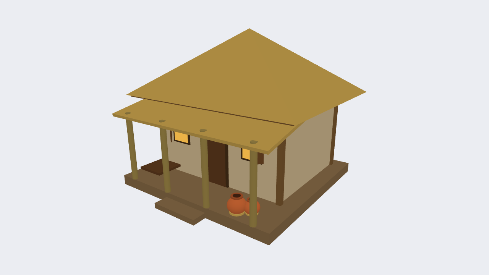
* **Source:** `src/objects/House.cpp` (`House::draw`)
* **How it was constructed:**
  1. **Earthen Plinth (*Viti/Dawa*):** Unit Cube translated to $Y = 0.125$ and scaled by $(4.40, 0.25, 4.20)$. Provides the raised foundation preventing floodwaters.
  2. **Entrance Step:** Unit Cube scaled by $(1.20, 0.125, 0.40)$ placed in front of the plinth.
  3. **Main Mud Walls:** Unit Cube scaled by $(3.60, 2.00, 2.80)$ centered at $Y = 1.25$. Timber corner posts at all 4 corners using 4 slender tall Cubes $(0.12, 2.05, 0.12)$.
  4. **Chouchala Hip Roof:** Unit 4-Sided Pyramid resting on top of the walls at $Y = 2.25$ scaled by $(4.80, 1.60, 4.00)$ with overhang. Dark under-eave rafter trim $(4.60, 0.05, 3.84)$.
  5. **Verandah (*Baranda*):** 4 cylindrical bamboo pillars $(r = 0.07, h = 1.70)$ supporting a sloping lean-to rectangular thatch roof tilted forward by $\mathbf{R}_x(+12^\circ)$. Side wooden bench built from a thin Cube $(0.70, 0.06, 0.70)$.
  6. **Door & Windows:** Timber frame Cubes with recessed panels and wooden shutters swung open at $\pm 45^\circ$ angles. Windows feature interior emissive golden warm lantern glow.

---

### 2. Outdoor Clay Cooking Stove (*Matir Chula*) with 3-Sided Bamboo Fence
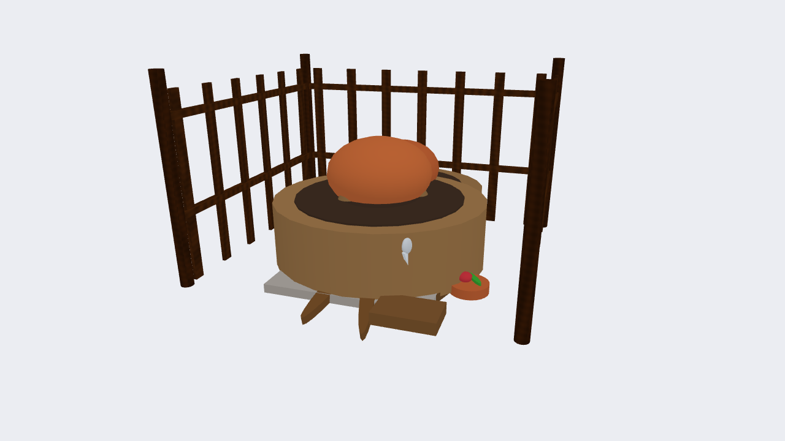
* **Source:** `src/objects/House.cpp` (`House::drawStove`, `drawStoveFence`)
* **How it was constructed:**
  1. **Clay Stove Body:** Unit Cylinder scaled by $(0.42, 0.22, 0.38)$ in baked mud clay earth.
  2. **Pot Prongs (3-Prong Trivet):** 3 Unit Cones arranged in an equilateral triangular circle of radius $0.16$ at $120^\circ$ angular intervals, pointing upwards to cradle the round pot.
  3. **Cooking Pot (*Patil/Hari*):** Unit Sphere scaled by $(0.18, 0.13, 0.18)$ resting on the prongs, colored seasoned cast-iron charcoal black.
  4. **Firewood Sticks (*Khori*):** 2 slender Unit Cylinders tilted by $\mathbf{R}_x(12^\circ-15^\circ)$ entering the front mouth of the stove.
  5. **3-Sided Bamboo Windbreak Fence (*Bera*):**
     * **4 Upright Posts:** 4 slender Unit Cylinders ($r = 0.022, h = 0.70$) placed at the back corners and front ends ($X = \pm 0.55, Z \in [-0.50, +0.45]$).
     * **Horizontal Tie-Rails:** 6 Unit Cubes along back ($X$), left ($Z$), and right ($Z$) sides at heights $Y = 0.24$ and $Y = 0.56$.
     * **Vertical Bamboo Slats/Pickets:** 19 Unit Cubes (7 along the back wall, 6 along the left wall, 6 along the right wall) providing a dense windbreak.
     * **Open Front:** The front ($+Z$) face remains completely open for cook seating and firewood feeding.
  6. **Courtyard Placement & Fire Safety:** Translated $2.4\text{m}$ to the side courtyard away from the main house plinth and straw thatch eaves, reflecting authentic Bengali village fire protection practices.

---

### 3. Terracotta Water Pitchers (*Matir Kolshi*)
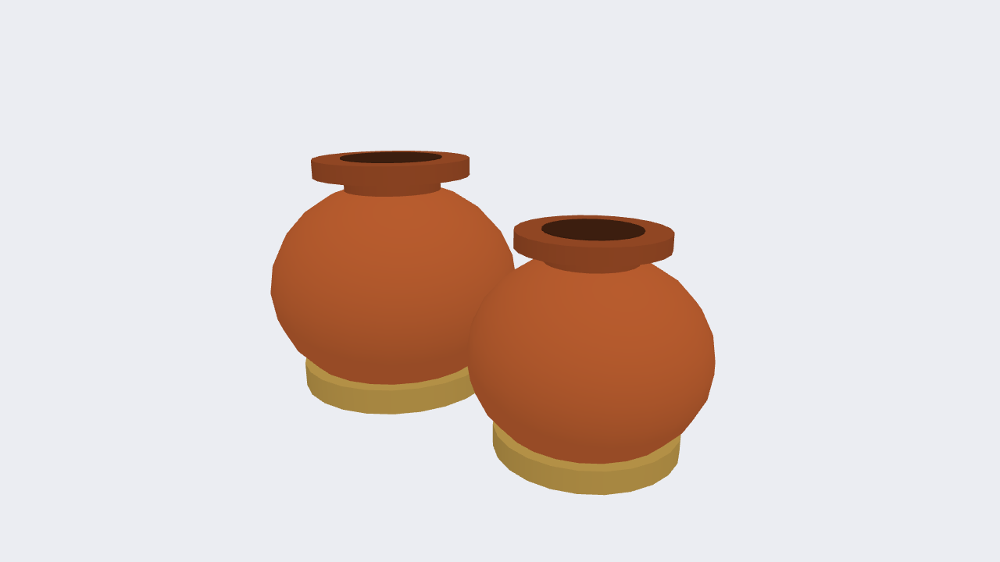
* **Source:** `src/objects/House.cpp` (`House::drawKolshi`)
* **How it was constructed:**
  1. **Spherical Belly:** Unit Sphere scaled by $(0.22, 0.20, 0.22)$ in rich terracotta burnt-orange clay.
  2. **Narrow Cylindrical Neck:** Unit Cylinder scaled by $(0.09, 0.14, 0.09)$ placed at $Y = 0.36$.
  3. **Flared Rim:** Wide shallow Unit Cylinder scaled by $(0.14, 0.04, 0.14)$ placed at $Y = 0.44$ creating the lip for holding and pouring.

---

### 4. Traditional Wooden Boat (*Dingi Nouka*)
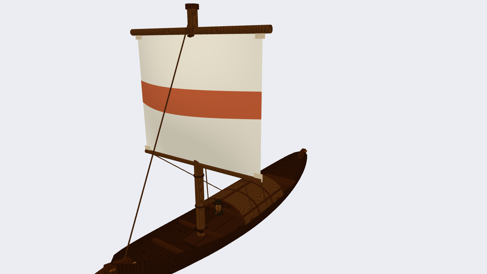
* **Source:** `src/objects/Boat.cpp` (`Boat::draw`)
* **How it was constructed:**
  1. **Crescent Double-Curved Hull:** Unit Upper Hemisphere flipped upside-down by $\mathbf{R}_x(180^\circ)$ and non-uniformly stretched by $\mathbf{S}(0.74, 0.36, 2.40)$.
  2. **Swept-Up Pointed Prow (Bow):** Unit Cone positioned at $Z = +1.80$, tilted forward by $\mathbf{R}_x(+76^\circ)$ and scaled by $(0.36, 1.15, 0.15)$.
  3. **Swept-Up Pointed Stern:** Unit Cone positioned at $Z = -1.80$, tilted backward by $\mathbf{R}_x(-76^\circ)$ and scaled by $(0.36, 1.15, 0.15)$.
  4. **Recessed Floorboards:** Thin Unit Cube $(0.42, 0.025, 2.40)$ recessed completely inside the hull at $Y = 0.04$.
  5. **Procedural Elliptical Ribs:** 7 transverse wooden ribs distributed along $Z \in [-1.2, +1.2]$ where width $w(z) = 0.50 \cdot \sqrt{1 - (z/2.2)^2}$ perfectly conforms to the hull's inner curvature.
  6. **Arched Bamboo Hood (*Chhoi*):** Unit Arched Shell scaled by $(0.74, 0.62, 1.65)$ with 3 reinforcing bamboo hoops at front, center, and back.
  7. **Hanging Hariken:** Suspended from the front hoop under the arch via a wire cylinder.

---

### 5. Authentic Tubular Kerosene Hurricane Lantern (*Hariken*)
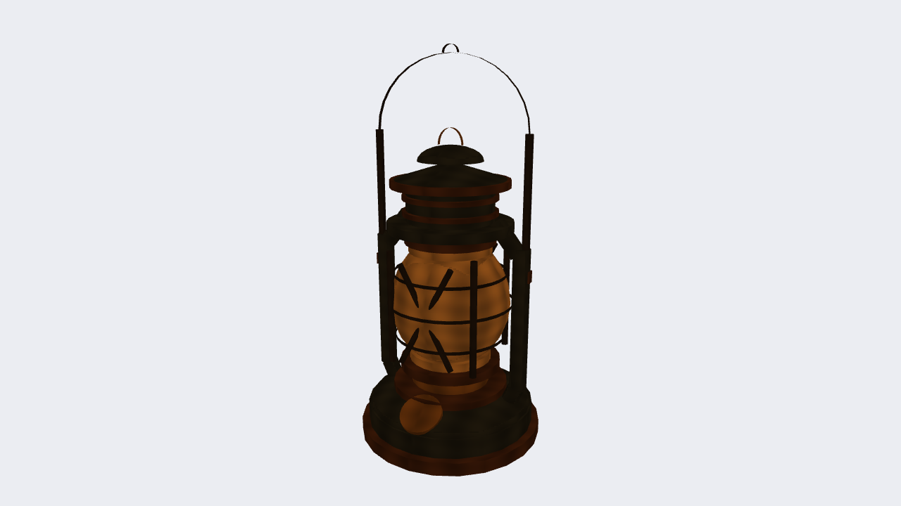
* **Source:** `src/objects/Charpai.cpp` (`Charpai::drawLantern`)
* **How it was constructed:**
  1. **Flanged Base Rim & Tiered Fount (Oil Reservoir):**
     * Bottom flared base rim using a thin Unit Cylinder ($0.098 \times 0.014 \times 0.098$).
     * Main cylindrical oil tank body ($0.090 \times 0.022 \times 0.090$) in weathered oxidized slate-metal.
     * Domed upper shoulder modeled with a Unit Hemisphere ($0.088 \times 0.022 \times 0.088$) and stepped collar ring.
     * Angled brass fuel filler spout and knurled cap on the front shoulder tilted at $\mathbf{R}_x(30^\circ)$.
  2. **Burner Throat & Wick Mechanism:**
     * Brass burner neck cylinder with perforated globe gallery basket.
     * Functional wick adjuster thumbwheel dial extending horizontally to the left on a slender brass shaft.
  3. **Luminous Kerosene Flame & Core:**
     * Dual emissive Unit Cones (outer glowing golden flame + hot white-gold inner core) emitting light.
  4. **Bulbous Glass Globe (Chimney):**
     * Non-uniform Unit Sphere ($0.064 \times 0.070 \times 0.064$) capturing the iconic swelling curved belly of vintage hurricane globes, with upper and lower seating collars in warm glowing amber glass.
  5. **Protective Wire Guard Cage:**
     * 3 horizontal circular wire hoops (lower, middle, upper) formed by pairs of semi-circular Unit Arches hugging the globe contours.
     * 4 vertical upright spring-steel wire ribs flanking the perimeter.
     * Diagonal crossing wire struts across front and back.
  6. **Dual Tubular Side Air Tubes:**
     * Left and right hollow air tubes: lower slanted elbows entering the fount shoulder, main vertical pipes ($h = 0.15$), and upper elbows curving inward to meet the chimney cowl collar.
     * Stamped handle pivot brackets/eyelets mounted on both tubes.
  7. **Tiered Ventilated Chimney Cowl (Smoke Cap):**
     * Flared lower cowl skirt, central ventilator column stack with draft louvers, horizontal shade canopy disk, conical hood roof, and domed crown cap.
     * Vertical brass globe lifting ring loop on top of the dome.
  8. **Tall Arched Wire Bail Handle:**
     * Twin upright wire side arms rising from the side tube eyelets, joined by a semi-circular Unit Arch overhead with an apex suspension notch.

---

### 6. Seated Boatman (*Majhi*) with Mathal & Boitha

* **Source:** `src/objects/Boatman.cpp` (`Boatman::draw`)
* **How it was constructed:**
  1. **Seated Human Rig:** Articulated torso, head, and limbs with sun-tanned skin and red checked lungi. Right arm reaches forward ($\theta = -35^\circ$) to grip the steering paddle.
  2. **Conical Bamboo Sunhat (*Mathal*):** Unit Cone scaled by $(0.32, 0.14, 0.32)$ tilted rakishly at $\mathbf{R}_x(8^\circ)$ on top of the head, framed by a split-bamboo cylindrical rim hoop $(0.33, 0.02, 0.33)$.
  3. **Long Steering Oar (*Boitha*):** 1.60m cylindrical wooden shaft pivoted at the gunwale, ending with a flat rectangular paddle blade $(0.16, 0.38, 0.02)$.

---

### 7. Traditional Woven Bed (*Charpai*)
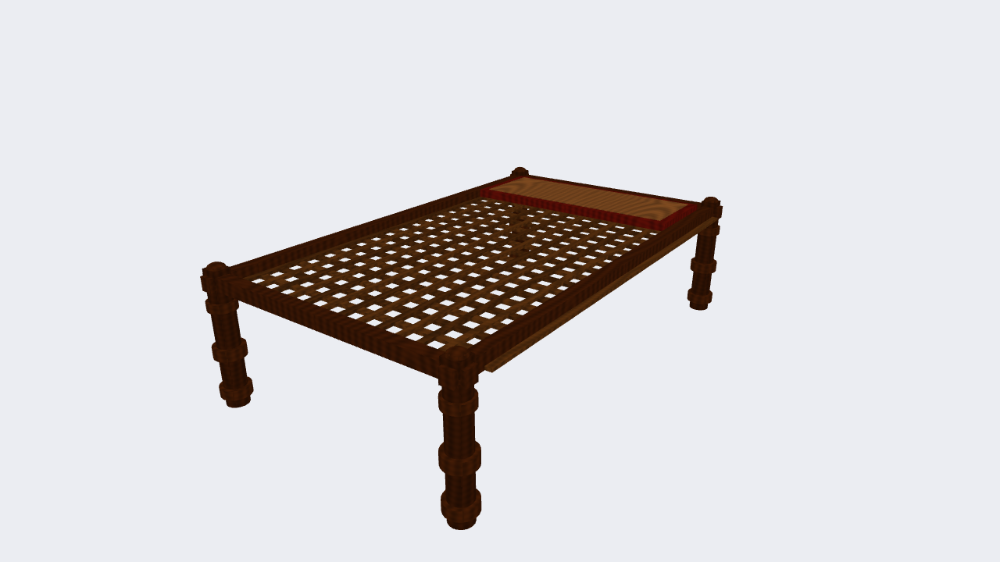
* **Source:** `src/objects/Charpai.cpp` (`Charpai::draw`)
* **How it was constructed:**
  1. **4 Turned Legs:** 4 Unit Cylinders $(r = 0.04, h = 0.50)$ at bed corners.
  2. **4 Mortise-and-Tenon Rails:** 2 long side rails $(0.05, 0.05, 2.00)$ and 2 short rails $(1.20, 0.05, 0.05)$ forming a rigid rectangular timber frame.
  3. **Criss-Cross Jute Rope Webbing (*Niwar*):** 8 longitudinal thin strips $(1.08, 0.015, 0.03)$ interlaced with 5 transverse strips $(0.03, 0.015, 1.80)$.

---

### 8. Traditional Embroidered Hand Fan (*Nakshi Haat Pakha*)
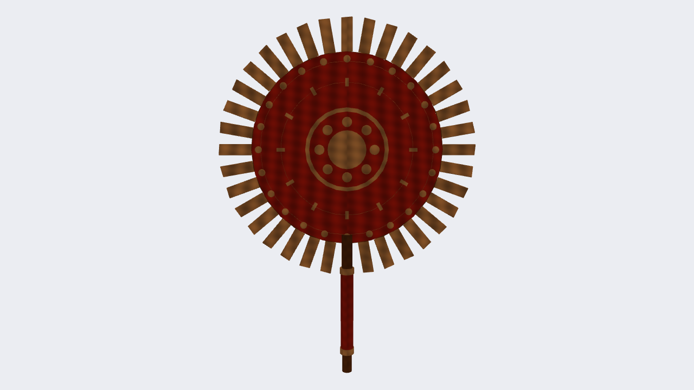
* **Source:** `src/objects/Charpai.cpp` (`Charpai::drawFan`)
* **How it was constructed:**
  1. **Bamboo Handle & Wrapped Grip:**
     * Exposed seasoned bamboo cane at the bottom tip and neck.
     * Wrapped crimson cotton grip section ($h = 0.18, r = 0.013$) bound with decorative white ferrules at top and bottom.
     * Sturdy vertical bamboo spine extending up through the rear face of the fan blade.
  2. **Accordion-Pleated White Cloth Frills (*Jhalor*):**
     * 36 radiating pleated fabric slats (`Unit Cubes` $0.022 \times 0.064 \times 0.003$) distributed around the full $360^\circ$ perimeter, tilted at alternating $\pm 18^\circ$ accordion fold angles to produce true 3D fabric pleating facets.
  3. **Circular Crimson Fan Disc (*Pakhar Pata*):**
     * Unit Cylinder rotated $90^\circ$ about the $X$-axis ($R = 0.188, \text{thickness} = 0.006$) so the circular face lies flat in the $XY$ viewing plane, finished in rich crimson woven fabric.
  4. **Bent Split-Bamboo Outer Binding Hoop:**
     * Paired semi-circular Unit Arches forming the outer rim border that clamps the pleated ruffles to the fabric disc.
  5. **Concentric Nakshi / Alpana Ornamental Embroidery (White on Red):**
     * Outer white beaded border ring with 24 individual pearl dots placed radially around $R = 0.174\text{m}$.
     * Middle concentric white ring framed by 12 radial leaf/scroll motif accents at $R = 0.130\text{m}$.
     * Inner white circular medallion disc ($R = 0.082\text{m}$) containing a crimson inset field, center white paisley (*kalka*) rosette hub, and 8 radiating embroidery petals.

---

### 9. Seated Elder on Charpai Holding Haat Pakha
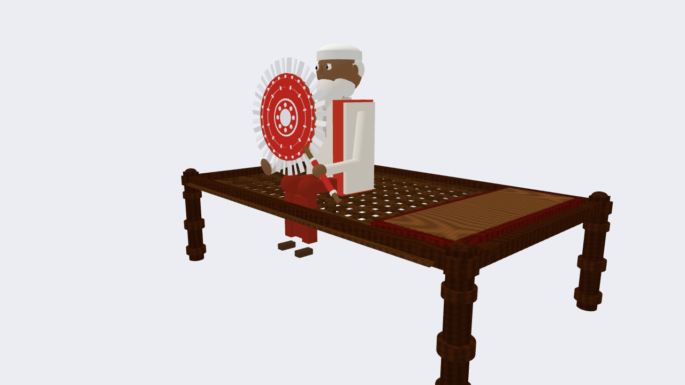
* **Source:** `src/objects/Person.cpp` & `main.cpp`
* **How it was constructed:**
  1. **Hierarchical Seated Pose:** Pelvis resting on the charpai mattress at $Y = 0.50$, thighs horizontal forward, knees bent $90^\circ$ with shins draped vertically down the frame edge.
  2. **Panjabi & Lungi:** Cotton white kurta over maroon lungi draped in two distinct columned legs.
  3. **Red Gamcha:** Draped over the right shoulder using a contoured cuboid.
  4. **Elder Identity:** Spherical head with white hair and distinguished white cotton beard.
  5. **Hand Holding Upright Fan:** Right shoulder angled forward, elbow bent upward ($\theta = -65^\circ$) holding the Haat Pakha upright at $+85^\circ$ elevation.

---

### 10. Reading Child Sitting Cross-Legged

* **Source:** `src/objects/Person.cpp` (`Person::draw`, `Person::drawBook`) & `main.cpp`
* **How it was constructed:**
  1. **Cross-Legged Posture:** Thighs spread laterally at $\pm 42^\circ$, shins folded inward at $\mp 105^\circ$ flat on the swept earthen courtyard.
  2. **Child Scaling & Attire:** Proportions scaled to $0.72\times$ adult rig, wearing vibrant saffron/orange shirt and forest green shorts.
  3. **Forward Reading Lean:** Torso tilted forward by $14^\circ$, head inclined down $22^\circ$ focused on the reading material.
  4. **Open Schoolbook / Storybook:**
     * **Hardcover Backing & Spine:** Navy blue cloth cover (`Unit Cube` $0.384 \times 0.010 \times 0.276$) with a rounded central spine cylinder.
     * **Two Distinct Open Page Blocks:** Left and right page blocks (`Unit Cubes` $0.165 \times 0.024 \times 0.260$) in warm off-white book paper, angled upward at $\pm 3.5^\circ$ for an authentic open book curve.
     * **Center Page Divider Line:** Dark recessed shadow seam line (`Unit Cube` $0.009 \times 0.006 \times 0.264$) running directly down the center along $Z$, creating a sharp, crisp line cleanly separating the left and right pages.
     * **Printed Text Lines:** 4 horizontal printed ink lines on the left page and 4 lines on the right page (`Unit Cubes`).

---

### 11. Village Hen (*Gramin Murgi*)
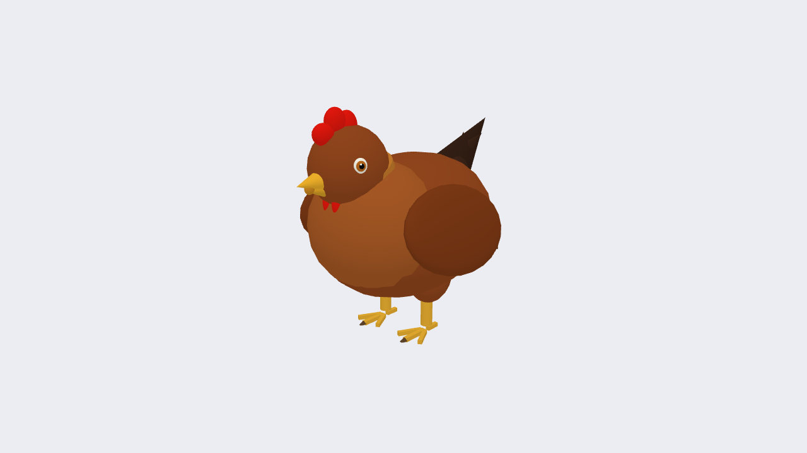
* **Source:** `src/objects/Hen.cpp` (`Hen::draw`)
* **How it was constructed:**
  1. **Plump Body:** Unit Sphere non-uniformly scaled by $(0.12, 0.11, 0.16)$ in reddish-brown plumage.
  2. **Folded Wings:** Thin angled Cubes rotated $12^\circ$ hugging both sides of the torso.
  3. **Head & Neck:** Sphere $(r = 0.06)$ elevated forward at $Y = 0.27, Z = 0.11$.
  4. **Crimson Comb & Wattle:** Vertical flattened sphere $(0.02, 0.035, 0.045)$ crowning the head and red wattle under the beak.
  5. **Sharp Beak:** Forward-pointing cone $(\mathbf{R}_x(90^\circ))$ in orange-yellow.
  6. **Expressive Circular/Elliptical Eyes:** Symmetrical bilateral eyes on left and right sides of the head ($X = \pm 0.052, Y = 0.283, Z = 0.138$):
     * Outer ivory/cream sclera ellipse (`Unit Sphere` $0.005 \times 0.0105 \times 0.0095$, rotated by $\pm 24^\circ$).
     * Inner gloss black pupil ellipse (`Unit Sphere` $0.0035 \times 0.0062 \times 0.0058$).
     * Tiny pure white specular catchlight highlight (`Unit Sphere` $0.0018$).
  7. **Legs & Claws:** Cylindrical shins with 3-toed flattened cuboid claw feet.
  8. **Fan Tail Feathers:** Inverted conical wedge pointing backward-upward at $-45^\circ$.

---

### 12. River Duck (*Pati Hash*)
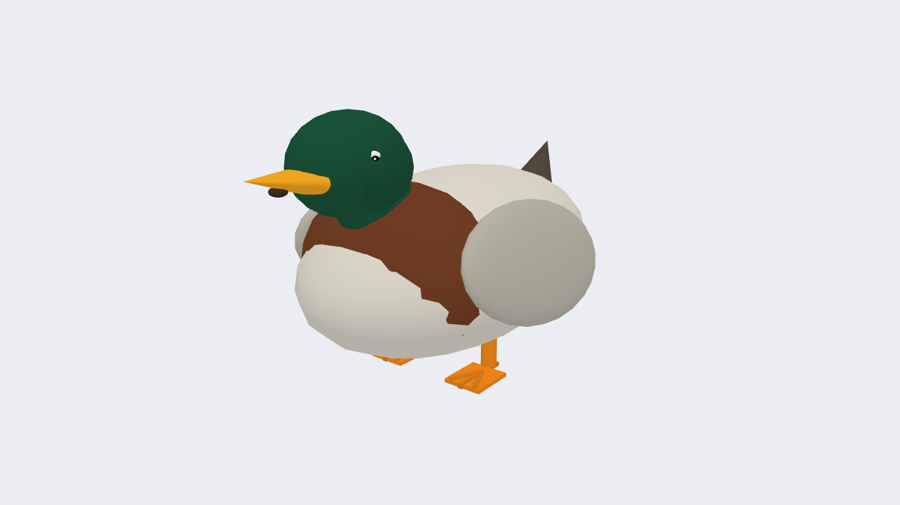
* **Source:** `src/objects/Duck.cpp` (`Duck::draw`)
* **How it was constructed:**
  1. **Buoyant Boat-Like Body:** Flattened Unit Sphere scaled by $(0.28, 0.20, 0.35)$ in off-white water plumage.
  2. **Mallard Green Head:** Rounded sphere $(r = 0.11)$ poised on an extended neck.
  3. **Broad Flat Bill:** Flattened cone scaled to $(0.06, 0.10, 0.03)$ rotated forward $\mathbf{R}_x(90^\circ)$, capturing the shovel bill morphology.
  4. **Expressive Circular/Elliptical Eyes:** Symmetrical bilateral eyes positioned cleanly on the curvature of the green mallard head ($X = \pm 0.097, Y = 0.418, Z = 0.320$):
     * Outer ivory/white sclera ellipse (`Unit Sphere` $0.0055 \times 0.016 \times 0.0135$, rotated outward by $\pm 22^\circ$).
     * Inner gloss black pupil ellipse (`Unit Sphere` $0.004 \times 0.0095 \times 0.008$).
     * High-contrast specular glint dot (`Unit Sphere` $0.0025$) giving realistic life and depth.
  5. **Paddle Feet & Upturned Tail:** Wide stance cylindrical legs and an angled cone tail tilted at $-50^\circ$.

---

### 13. Coconut Palm Tree (*Narikel Gach*)
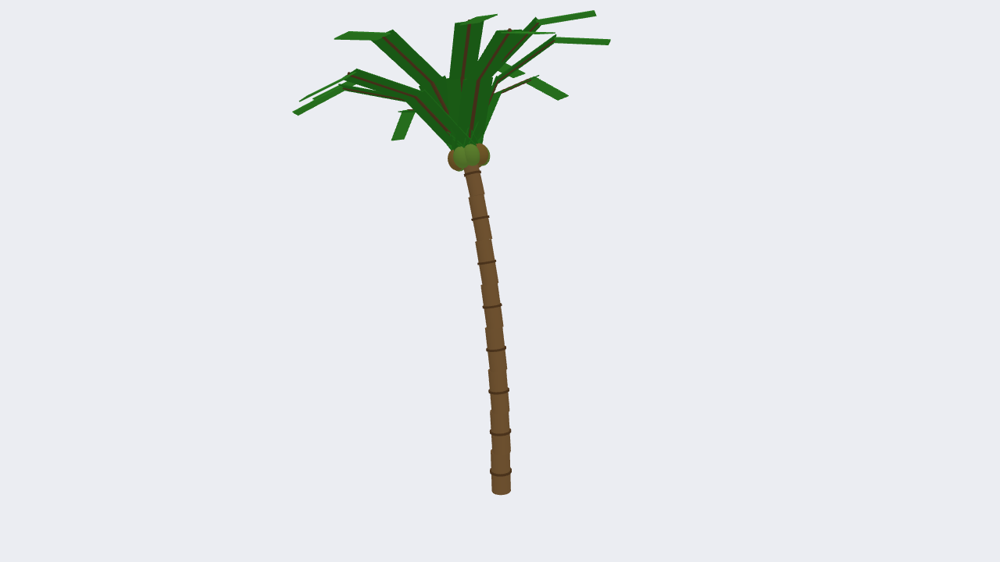
* **Source:** `src/objects/Tree.cpp` (`Tree::drawPalm`)
* **How it was constructed:**
  1. **Segmented Leaning Trunk:** 8 sequentially stacked cylinder segments $(r = 0.16 \to 0.11, h = 0.75)$ each tilted by $1.8^\circ$ producing an organic natural trunk curve.
  2. **Annular Leaf Scars:** Cylindrical ring bands $(1.15\times \text{radius})$ marking each growth ring.
  3. **Coconut Cluster:** 6 green spherical coconuts nestled circularly around the crown apex.
  4. **10 Cascading 3-Segment Fronds:** Each frond is a 3-stage kinematic chain:
     * Segment 1 (arch up and out, $30^\circ$)
     * Segment 2 (bend outward, $+32^\circ$)
     * Segment 3 (droop steeply downward, $+38^\circ$) with central rachis and wide leaflet fans.

---

### 14. Banana Tree (*Kola Gach*)
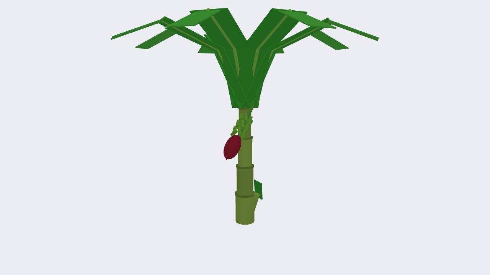
* **Source:** `src/objects/Tree.cpp` (`Tree::drawBanana`)
* **How it was constructed:**
  1. **Succulent Pseudostem Trunk:** Tall smooth cylinder $(r = 0.18, h = 2.40)$ in juicy leaf-sheath green.
  2. **7 Arching Paddle Leaves:** Distributed radially at $51.4^\circ$ intervals. Each leaf contains 3 drooping sections: rising stalk ($28^\circ$), wide broad paddle ($+42^\circ$), and drooping tip ($+48^\circ$).
  3. **Hanging Fruit Cluster:** Curved stem cylinder hanging downward holding a spiral cluster of green baby bananas.
  4. **Banana Flower Blossom (*Mocha*):** Teardrop elongated sphere $(0.13, 0.28, 0.13)$ hanging at the terminal apex in deep purple-maroon.

---

### 15. Branching Mango/Banyan Tree (*Aam / Bot Gach*)

* **Source:** `src/objects/Tree.cpp` (`Tree::drawGeneral`)
* **How it was constructed:**
  1. **Gnarled Primary Trunk:** Thick sturdy cylinder $(r = 0.40, h = 2.80)$ with 4 buttress root flares spreading at base.
  2. **4 Spreading Limbs:** Main boughs radiating outward at $90^\circ$ azimuthal intervals, tilted $38^\circ$ upward.
  3. **Multi-Cluster Foliage Canopy:** 8 overlapping spherical foliage clusters $(2.0 \text{ to } 2.6\text{m diameter})$ with varied organic offsets and tonal green variations creating a dense natural canopy.

---

### 16. Dense Bamboo Grove (*Bansher Jhar*)
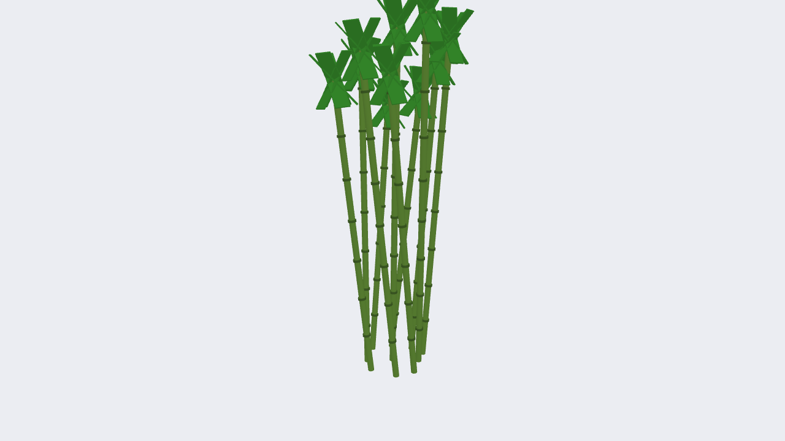
* **Source:** `src/objects/Tree.cpp` (`Tree::drawBamboo`)
* **How it was constructed:**
  1. **Clump of 8 Tall Leaning Culms:** Tall slender cylinders $(r = 0.045, h = 4.2 \to 5.5\text{m})$ leaning naturally in diverse compass directions.
  2. **Swollen Culm Nodes:** Raised cylindrical ring collars $(0.06, 0.03, 0.06)$ repeated every $0.70\text{m}$ along the stalk.
  3. **Feathery Leaf Sprays:** 4 angled rectangular leaf blades $(0.18, 0.90, 0.02)$ radiating from the apex crown.

---

### 17. Rural Rice Plant (*Dhan Gachh*)
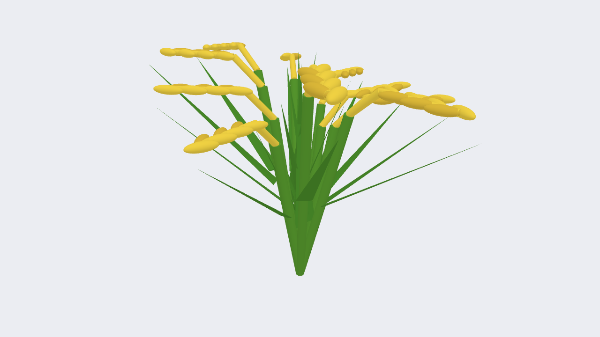
* **Source:** `src/objects/Terrain.cpp` (`Terrain::drawRiceClump`)
* **How it was constructed:**
  1. **Radial Tillers:** 5 outward-radiating stalks tilted $14^\circ$ from vertical.
  2. **Green Paddy Stalks:** Slender cylinders $(r = 0.015, h \approx 1.5\text{m})$.
  3. **Arching Rice Leaf Blades:** Angled thin green cones $(0.03, 1.0, 0.008)$ arching at $35^\circ$.
  4. **Drooping Golden Panicles (*Dhaner Shish*):** Cones bent gracefully downward by $52^\circ$ under the weight of ripening grain, tipped with a golden terminal grain bead.

---

### 18. National Water Lily (*Shapla*)
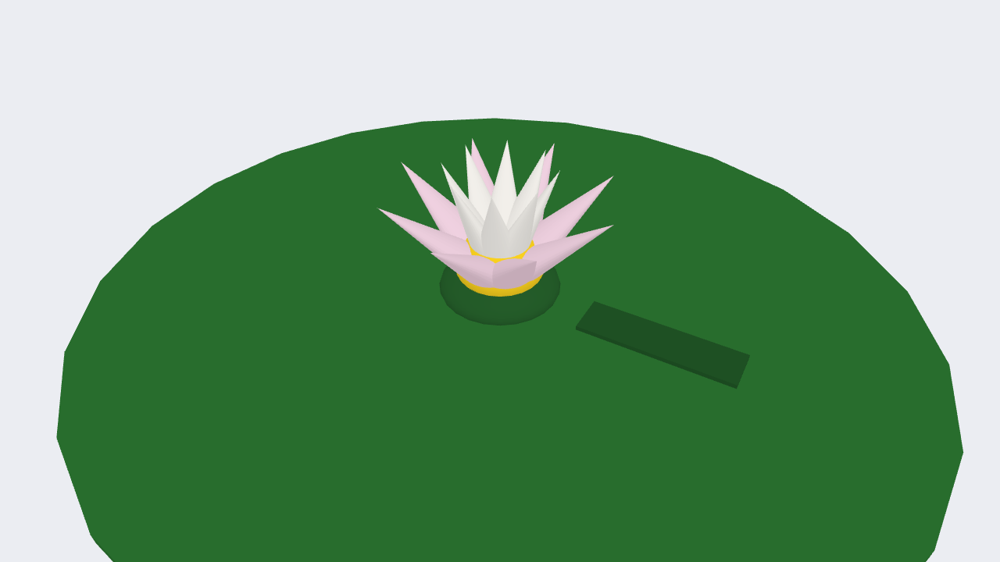
* **Source:** `src/objects/River.cpp` (`River::drawShapla`)
* **How it was constructed:**
  1. **Floating Lily Pad:** Flat green circular cylinder $(r = 0.40, h = 0.015)$ resting on water surface.
  2. **6 Radiating Petals:** White/pale pink cones angled at $35^\circ$ elevation spaced evenly around the flower perimeter.
  3. **Golden Pollen Heart:** Center spherical button $(r = 0.04)$ in bright dandelion pollen yellow.

---

### 19. Riverbank Catkin Reeds (*Kashbon*)

* **Source:** `src/objects/River.cpp` (`River::drawKashbonCluster`)
* **How it was constructed:**
  1. **Slender Reed Stalks:** 7 thin green-brown cylinders $(r = 0.02, h = 1.2 \to 1.55\text{m})$ swaying with random tilts.
  2. **Catkin Feathery Plumes:** Soft white cylindrical plumes $(0.022, 0.38, 0.022)$ along the upper stem.
  3. **Plume Tip:** Spherical white terminal cap $(r = 0.022)$ crowning each catkin reed.

---

### 20. Rural Woven Bamboo Fence (*Bansh-er Bera*)
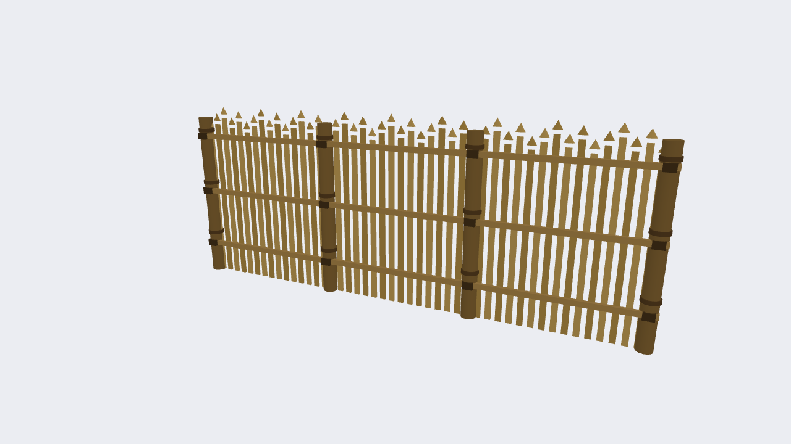
* **Source:** `src/objects/Terrain.cpp` (`Terrain::drawBambooFence`)
* **How it was constructed:**
  1. **Upright Bamboo Posts:** Vertical cylinders $(r = 0.045, h = 1.10\text{m})$ spaced every $1.0\text{m}$.
  2. **Horizontal Tie-Rails:** 2 split bamboo horizontal beams running at $Y = 0.35$ and $Y = 0.85$.
  3. **Crossed Diagonal Bamboo Pickets:** Paired criss-crossing diagonal bamboo slats $(\mathbf{R}_z(\pm 32^\circ))$ forming diamond lattice bays.

---

### 21. River Mooring Stake (*Khuti*)
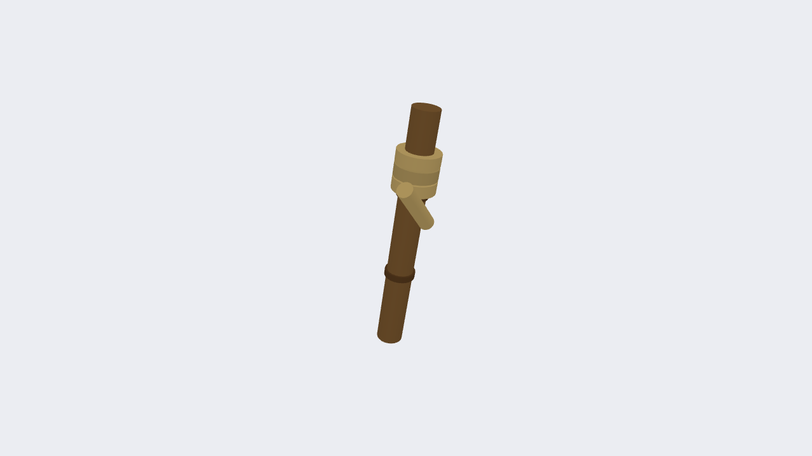
* **Source:** `src/objects/River.cpp` (`River::drawMooringStake`)
* **How it was constructed:**
  1. **Driven Bamboo Post:** Weathered bamboo cylinder $(r = 0.05, h = 0.85)$ driven at a $10^\circ$ angle into the riverbank sand.
  2. **Coiled Jute Rope:** Outer cylindrical collar $(r = 0.075, h = 0.06)$ simulating thick twisted coir mooring rope tied securely around the stake.

---

### 22. Luminous Full Moon

* **Source:** `src/objects/Moon.cpp` (`Moon::draw`)
* **How it was constructed:**
  1. **Core Emissive Moon Sphere:** Unit Sphere scaled by $(2.0, 2.0, 2.0)$ in pale yellow-white. Emissive mode enabled to bypass standard diffuse attenuation.
  2. **Radial Atmospheric Corona Halo:** Concentric larger sphere $(2.8, 2.8, 2.8)$ with subtle translucent amber illumination simulating lunar glow in humid river air.
